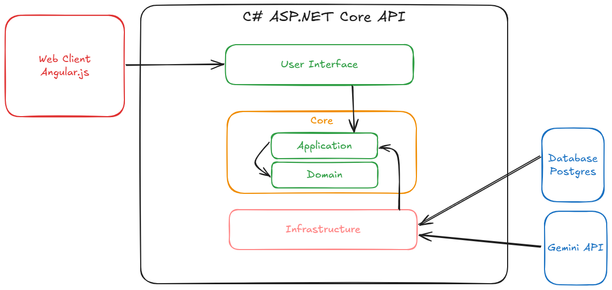

# EI Dungeon API

> Status: Developing ⚠️

A C# ASP.NET Core API for the Ei Dungeon application. The project consists of a Role Playing Game (RPG) simulator with artificial players controlled by generative AI.

We also have a [web interface](https://github.com/wilknisoliveira/ei-dungeon-web) in development.

Do you want to know more about the project goals? Go to the 'Next steps' section. 


# Index
- <a href="#✔️-project-features">Project features</a>
- <a href="#💻-architecture">Architecture</a>
- <a href="#🔨-how-to-install-this-project">Install</a>
- <a href="#👨‍💻-next-steps">Next steps</a>
- <a href="#author">Author steps</a>

# ✔️ Project features
- [x] Auth with Role Based JWT
- [x] Clean Architecture
- [x] Swagger
- [x] SQL
- [x] Migrations
- [x] CORS
- [x] Logs file generation
- [x] Health Check interface
- [x] Repository pattern
- [x] IUnit Of Work pattern
- [x] Exception Handler
- [x] Localization for Multilanguage
- [x] Docker settings

# 💻 Architecture


# 🔨 How to install this project?
## Stack
First of all, make sure that you have the following technologies in your environment:
- .NET 8
- Postgres

## Git clone
```
# Clone this repository
$ git clone https://github.com/wilknisoliveira/ei-dungeon-back.git
```

## Database
- Create a schema with Postgres. You can name it as 'ei_db';
- Update your appsettings (or User Secrets) with:
	- Database strings connections to your localhost database;
	- GeminiApiKey. You can use the [gemini documentation](https://ai.google.dev/gemini-api/docs/api-key?_gl=1*1o49rdj*_up*MQ..&gclid=Cj0KCQiAj9m7BhD1ARIsANsIIvAfxmmrn8ErKq_oolGXsezbNN3m1ult-glRDcvptTq_Y5KLXkj1g0MaAngvEALw_wcB) to learn how to get your own API key.

## Seeding
Run the following script in the Postgres to allow uuid-ossp extension:
```
CREATE EXTENSION IF NOT EXISTS "uuid-ossp";
```

The default user is:
	- Username: admin
	- Password: admin123

Please, for security change the password of the default username in the first application running.

Populate the database with some game info using the controller "/api/game/GameInfo". You can use an example at "Infrastructure/Utils/GameInfoSeeding.json".

## Run
Now you can start the application with the following command:
```
dotnet run
```

# 👨‍💻 Next Steps
The long-term goal would be to scale the application so RPG lovers can create quick matches.

- [ ] Bug fixing
- [ ] Logout
- [ ] Delete game
- [ ] Keep user logged option
- [ ] Improve security 
- [ ] Messages response by stream
- [ ] Focus on D&D system
- [ ] PremiumUser Enable Flow
- [ ] Scale use of AI API
- [ ] Change Http request AI API for dedicated library
- [ ] Admin tools for tunning the AI responses
- [ ] Apply Multilanguage to all Controllers
- [ ] Enable Multilanguage to games
- [ ] Skip turn


 # Author
 Wilknis Deyvis

 [](https://www.linkedin.com/in/wilknis/)