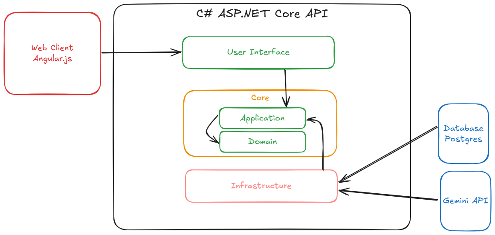

# EI Dungeon API

> Status: Developing ⚠️

EI Dungeon is an ASP.NET Core API for a role-playing game simulator with players controlled by generative AI. The [web interface](https://github.com/wilknisoliveira/ei-dungeon-web) is developed separately.


## Project features

- Role-based JWT authentication
- Clean Architecture
- Swagger/OpenAPI
- PostgreSQL with EF Core migrations
- CORS
- File and console logging
- Health checks and dashboard
- Repository and Unit of Work patterns
- Central exception handling
- Localization
- Docker and Docker Compose support

## Architecture



See [ARCHITECTURE.md](./ARCHITECTURE.md) for the current application and container architecture.

## Run with Docker Compose

This is the simplest local setup. It runs the backend and PostgreSQL together and requires:

- Docker Engine
- Docker Compose v2 (`docker compose`)

From the repository root, create your local environment file:

```powershell
Copy-Item .env.example .env
```

Edit `.env` before starting the stack. The file is ignored by Git and must not be committed.

| Variable | Purpose | Example default |
|---|---|---|
| `POSTGRES_DB` | PostgreSQL database created for the application | `ei_db` |
| `POSTGRES_USER` | PostgreSQL application user | `ei_dungeon` |
| `POSTGRES_PASSWORD` | Local PostgreSQL password | Development placeholder; change it |
| `POSTGRES_PORT` | PostgreSQL port published on the host | `5432` |
| `BACKEND_PORT` | Backend listen port inside the container and on the host | `8080` |
| `ASPNETCORE_ENVIRONMENT` | ASP.NET Core environment | `Development` |
| `CORS_ALLOWED_ORIGINS` | Comma-separated origins allowed by CORS | `http://localhost:8000` |
| `OPENROUTER_API_KEY` | API key used for generated game responses | Replace the placeholder |
| `JWT_SECRET` | Signing secret for access tokens | Replace the development placeholder |

Compose reads `.env`, builds the PostgreSQL connection string, and maps values to ASP.NET Core environment keys such as `TokenConfigurations__Secret`. These container environment variables override the base values in `appsettings.json`. The `.env` variables are not passed blindly to every container.

Build and start the complete stack:

```powershell
docker compose up -d --build
```

PostgreSQL must pass its health check before the backend starts. On a fresh database volume, PostgreSQL also creates the `uuid-ossp` extension. The backend then applies all pending EF Core migrations during startup.

Check the containers and logs:

```powershell
docker compose ps
docker compose logs -f
```

With the default environment values, open:

- API health: <http://localhost:8080/health>
- Health dashboard: <http://localhost:8080/healthDashboard>
- Swagger UI in the `Development` environment: <http://localhost:8080/swagger>

If port `8080` or `5432` is already occupied, change `BACKEND_PORT` or `POSTGRES_PORT` in `.env` and start the stack again.

Stop both services without removing their containers or database data:

```powershell
docker compose stop
```

Remove both service containers and their network while preserving database data:

```powershell
docker compose down
```

To reset the local database completely, remove the named volume too:

```powershell
docker compose down -v
```

The `-v` command permanently deletes the local Compose database. PostgreSQL initialization scripts run only when a new data volume is created. If the initialization SQL changes, reset the volume or apply the SQL manually to the existing database.

## Manage only the backend with Docker Compose

Use the service name `backend` to work on the API without stopping or recreating PostgreSQL.

Build only the backend image:

```powershell
docker compose build backend
```

Rebuild and recreate only the backend while PostgreSQL is already running:

```powershell
docker compose up -d --build --no-deps backend
```

The `--no-deps` option prevents Compose from starting or recreating dependencies. Without it, `docker compose up -d backend` may also start the declared `postgres` dependency. Use the complete stack command first when PostgreSQL is not running.

Operate only the backend container:

```powershell
# Stop only the backend
docker compose stop backend

# Start only the existing backend container
docker compose start backend

# Restart only the backend
docker compose restart backend

# Follow only backend logs
docker compose logs -f backend
```

These commands preserve the PostgreSQL container and its named volume. Do not use `docker compose down` when the intention is to affect only the backend because `down` targets the entire Compose project.

## Run without Docker

Install:

- .NET 9 SDK
- PostgreSQL
- `dotnet-ef` if migrations need to be managed locally

Create a PostgreSQL database named `ei_db` and enable the required extension:

```sql
CREATE EXTENSION IF NOT EXISTS "uuid-ossp";
```

Keep real configuration in .NET User Secrets or environment variables. The main values are:

- `PostgresConnection:PostgresConnectionString`
- `keys:OpenRouterApiKey`
- `TokenConfigurations:Secret`
- `Cors:AllowedOrigins`

Run migrations from the application project directory:

```powershell
Set-Location .\ei-back
dotnet ef database update --context EIContext
Set-Location ..
```

Start the API:

```powershell
dotnet run --project .\ei-back\ei-back.csproj
```

The default seeded login is `admin` / `admin123`. Change the password after the first login. Game information can be seeded through `POST /api/game/GameInfo` using `ei-back/Infrastructure/Utils/GameInfoSeeding.json` as an example request body.

## Tests

```powershell
dotnet build .\ei-back\ei-back.csproj
dotnet test .\ei-back.Tests\ei-back.Tests.csproj
```


## Author

Wilknis Deyvis

[](https://www.linkedin.com/in/wilknis/)
